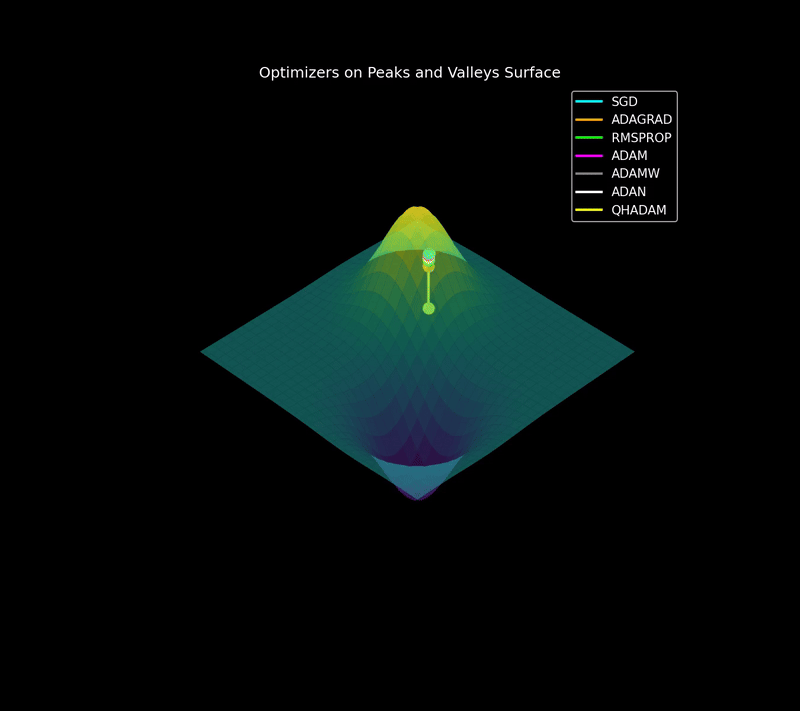

| **Smooth Valley** | **Narrow Valley** |
| :---: | :---: |
|  |  |
| **Saddle Point** | **Peaks and Valleys** |
| |  |


<details>
<summary><strong>SGD</strong></summary>

# SGD
$$ w_{t+1} = w_{t} - \eta \nabla L(w_{t}) $$
* $w_{t+1}$ is the updated weight
* $w_{t}$ is the current weight at time step $t$
* $\eta (eta)$ is the learning rate, which controls the step size
* $\nabla L(w_{t})$ is the gradient of the loss function calculated with respect to just a single training example
</details>

<details>
<summary><strong>Adagrad</strong></summary>

# Adagrad
A cache, often called **$s_{t}$** or cache, is initialized to zeros for each parameter in the model.
In each training step, as the gradients are calculated, Adagrad squares each gradient element-wise and adds it to the corresponding entry in the cache.

$$ s_{t} = s_{t-1} + g_{t}^{2} $$
* $s_{t}$ is the running cache at time step $t$
* $s_{t-1}$ is the cache from the previous time step
* $g_{t}$ is the current gradient

**Parameter Update:**

$$ w_{t+1} = w_{t} - \frac{\eta}{\sqrt{s_{t}+\epsilon}} g_{t} $$
* $w_{t+1}$ is the updated weight at the next time step ($t + 1$)
* $w_{t}$ is the current weight at time step $t$
* $\eta (eta)$ is the learning rate, a hyperparameter that controls the step size
* $g_{t}$ is the current gradient of the loss function with respect to the weights
* $\epsilon (epsilon)$ is a small number to prevent division by zero
</details>

<details>
<summary><strong>RMSprop</strong></summary>

# RMSprop
$$ s_{t} = \beta s_{t-1} + (1 - \beta)g_{t}^2 $$
* $s_{t}$ is the new moving average of squared gradients
* $\beta (beta)$ is a decay rate hyperparameter (typically around 0.9) that controls how much of the old average to keep
* $g_{t}$ is the current gradient

**Parameter Update:**  

$$ w_{t + 1} = w_{t} - \frac{\eta}{\sqrt{s_{t}} + \epsilon} g_{t} $$ 
* $w_{t+1}$ is the updated weight
* $w_{t}$ is the current weight
* $\eta (eta)$ is the learning rate
* $\epsilon (epsilon)$ is a small number to prevent division by zero
</details>

<details>
<summary><strong>Adam</strong></summary>

# Adam
**first Moment(Momentum) and Second Moment(RMSprop):** 
$$m_{t} = \\beta_{1} m_{t-1} + (1 - \\beta_{1})g_{t}$$
$$v_{t} = \\beta_{2} v_{t-1} + (1 - \\beta_{2})g_{t}^{2}$$

* **$m_{t}, v_{t}$** are the moving averages for the first and second moment, respectively.
* **$g_{t}$** is the gradient at the current timestep `t`.
* **$\beta_{1}, \beta_{2}$** are the exponential decay rates for the moving averages. Common values are $\beta_{1}$ = `0.9` and $\beta_{2}$ = `0.999`

**Bias Correction:**

Since the moving averages **$m_{t}$** and **$v_{t}$** are initialized to zero, they are biased towards zero during the initial timesteps. Adam corrects this bias
* First moment correction:
$$\hat{m_{t}} = \\frac{m_{t}}{1-\\beta_{1}^{t}} $$
* Second moment correction:
$$\hat{v_{t}} = \\frac{v_{t}}{1-\\beta_{2}^{t}} $$
* **$\hat{m_{t}}, \hat{v_{t}}$** are the bias-corrected moment estimates.
* `t` is the current timestep.

**Parameter update**
The final step uses the bias-corrected estimates to update the model's weights.
$$w_{t+1} = w_{t} - \eta \frac{\hat{m_{t}}}{\sqrt{\hat{v_{t}} + \epsilon}}$$
* **$w_{t+1}$** is the updated weight.
* **$w_{t}$** is the current weight.
* **$\eta$** is the learning rate.
* **$\epsilon$** is a small number to prevent division by zero (e.g., `1e-8`).
</details>

---

# Save .mp4 to .gif

Copy this script in text file and save it as `.bat` file, and run it. 

```markdown
```bash
@echo off
setlocal enabledelayedexpansion

:: Set the directory where your MP4 files are located.
SET "VIDEO_DIR=path"

:: Set the directory where you want to save the GIFs.
SET "OUTPUT_DIR=path"

:: SCRIPT START
echo Starting GIF conversion process...

:: Create the output directory if it doesn't exist.
if not exist "%OUTPUT_DIR%" (
    echo Creating output directory: %OUTPUT_DIR%
    mkdir "%OUTPUT_DIR%"
)

:: Loop through a list of the base filenames.
FOR %%N IN (
    Smooth_Valley
    Narrow_Valley
    Peaks_and_Valleys
    Saddle_Point
) DO (
    echo.
    echo --- Processing: %%N ---

    SET "INPUT_VIDEO=%VIDEO_DIR%\animation_%%N.mp4"
    SET "OutputName=%%N"
    SET "OutputName=!OutputName:_=!"
    SET "OUTPUT_GIF=%OUTPUT_DIR%\!OutputName!.gif"

    SET "PALETTE_FILE=%TEMP%\palette_%%N.png"

    echo [Step 1] Generating palette...
  
    ffmpeg -i "!INPUT_VIDEO!" -vf "fps=30,scale=800:-1:flags=lanczos,palettegen" -y "!PALETTE_FILE!" && (
        echo [Step 2] Creating GIF using the new palette...
        ffmpeg -i "!INPUT_VIDEO!" -i "!PALETTE_FILE!" -lavfi "fps=30,scale=800:-1:flags=lanczos[x];[x][1:v]paletteuse" -y "!OUTPUT_GIF!"
    )

    echo Finished %%N!
)

echo.
echo All conversions are complete!
pause
```

